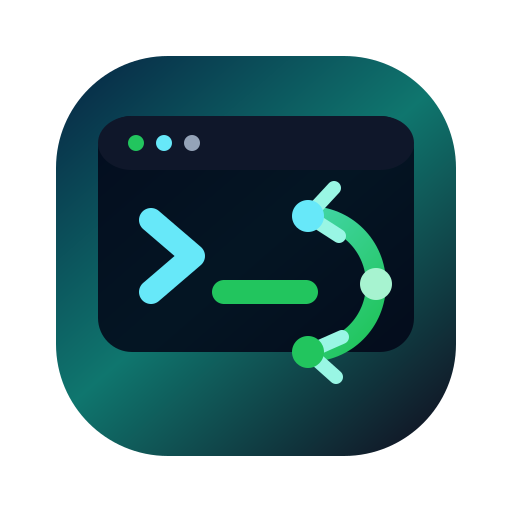
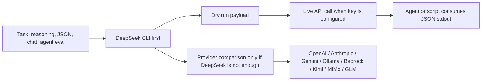

<p align="center">
  
</p>

<h1 align="center">DeepSeek CLI</h1>

<p align="center">
  DeepSeek-first API CLI and Agent Skills toolkit, with multi-provider fallback for OpenAI, Anthropic, Gemini, Ollama, Bedrock, Kimi, MiMo, and GLM.
</p>

<p align="center">
  <a href="https://github.com/Harzva/deepseek-cli/actions/workflows/ci.yml"></a>
  <a href="LICENSE"></a>
  <a href="package.json"></a>
  <a href="docs/html/index.html"></a>
</p>

<p align="center">
  <a href="#quick-start">Quick start</a>
  ·
  <a href="#deepseek-first-workflow">DeepSeek-first workflow</a>
  ·
  <a href="#npm-packages">npm packages</a>
  ·
  <a href="#agent-skills">Agent Skills</a>
  ·
  <a href="docs/html/visual-tutorials.html">Visual docs</a>
  ·
  <a href="CLI_REFERENCE.md">CLI reference</a>
</p>

## Why this repo exists

DeepSeek is often the first practical choice for cost-sensitive reasoning, OpenAI-compatible chat, JSON payloads, and agent experiments. This repository makes that path explicit:

| Goal | What to use |
| --- | --- |
| Start with DeepSeek quickly | `deepseek chat "hello" --dry-run --json` |
| Compare other providers only when needed | `provider-api compare` and `provider-api recommend "task"` |
| Give agents a stable execution surface | install the bundled Skills and call CLI commands with `--json` |
| Avoid accidental live calls | use `--dry-run` before using real API keys |
| Understand protocol boundaries | read Native / Compatible / Harness visual guides |

The project still keeps the original multi-provider toolkit because real agent work often needs provider comparison, migration, fallback, or local/offline testing. The repo positioning is now **DeepSeek first, provider-aware second**.

## Quick start

Install from npm after publication:

```bash
npm install -g @just-agent/deepseek-cli
deepseek chat "hello" --dry-run --json
provider-api recommend "cheap reasoning json extraction" --json
```

Run from source:

```bash
npm install --ignore-scripts
npm run validate
npm test
```

Try the DeepSeek path without making a live API request:

```bash
node packages/deepseek-api-cli/bin/deepseek.mjs chat "hello" --dry-run --json
node packages/provider-api-cli/bin/provider-api.mjs recommend "cheap reasoning json extraction" --json
node packages/provider-api-cli/bin/provider-api.mjs skills install --all --dir ./tmp-skills --json
```

## DeepSeek-first workflow



## Command map

| Surface | Command | Role |
| --- | --- | --- |
| DeepSeek | `deepseek` | Primary path for OpenAI-compatible DeepSeek chat, JSON, reasoning, and tool-call payloads |
| Provider router | `provider-api` | Compare providers, recommend a route, install Skills, print contracts |
| OpenAI | `openai-api` | Responses API, structured outputs, built-in tools |
| Anthropic | `anthropic-api` | Claude Messages API and native Claude workflows |
| Gemini | `gemini-api` | GenerateContent, JSON, multimodal, function calling |
| Ollama | `ollama-api` | Local and offline model testing |
| Bedrock | `bedrock-api` | AWS Bedrock Converse dry-run and enterprise routing |
| China providers | `kimi`, `mimo`, `glm` | OpenAI-compatible provider experiments |

## npm packages

The workspace now contains a primary DeepSeek-first package and individual provider packages:

| Package | Purpose |
| --- | --- |
| `@just-agent/deepseek-cli` | Main install target. Provides `deepseek`, `deepseek-cli`, `provider-api`, and fallback provider commands. |
| `@just-agent/provider-api-cli` | Full provider suite package with all commands and Skills. |
| `@just-agent/deepseek-api-cli` | Smaller DeepSeek-only command package. |
| `@just-agent/provider-api-core` | Shared runtime used by every CLI package. |
| `@just-agent/openai-api-cli`, `@just-agent/anthropic-api-cli`, `@just-agent/gemini-api-cli`, `@just-agent/ollama-api-cli`, `@just-agent/bedrock-api-cli` | Native provider packages. |
| `@just-agent/kimi-api-cli`, `@just-agent/mimo-api-cli`, `@just-agent/glm-api-cli` | China provider fallback packages. |

Package verification:

```bash
npm run pack:check
npm run pack:npm
```

`npm run pack:npm` writes publish-ready tarballs and `npm-pack-manifest.json` into `dist/npm/`. The directory is ignored by git and uploaded by the `npm-package` GitHub Actions workflow.

## Agent Skills

The CLI is the execution surface. Skills are the agent-readable instruction layer.

```bash
node packages/provider-api-cli/bin/provider-api.mjs skills list --json
node packages/provider-api-cli/bin/provider-api.mjs skills install --all --dir ./tmp-skills --json
```

Skill boundaries:

- CLI prints model output or JSON envelopes on stdout.
- Diagnostics belong on stderr.
- API keys are redacted in doctor, config, dry-run, and curl output.
- Tool execution belongs to the caller or harness, not to the API wrapper.
- MCP is treated as an agent integration protocol, not as another model generation endpoint.

## Visual documentation

| Guide | Use it for |
| --- | --- |
| [`docs/html/visual-tutorials.html`](docs/html/visual-tutorials.html) | Native / Compatible / CLI / Skill / Harness overview |
| [`docs/html/native-compatible-guide.html`](docs/html/native-compatible-guide.html) | DeepSeek, Kimi, MiMo, base URL, adapter, and Harness boundaries |
| [`docs/html/cli-agent-cli-guide.html`](docs/html/cli-agent-cli-guide.html) | API tool CLI vs Agent coding CLI |
| [`docs/VISUAL_TUTORIALS_FINAL.md`](docs/VISUAL_TUTORIALS_FINAL.md) | Markdown version for GitHub reading, Agent/RAG ingestion, and notes |

## Repository layout

```text
packages/deepseek-cli/          Primary npm package: DeepSeek-first bundle
packages/deepseek-api-cli/      DeepSeek-focused CLI package
packages/provider-api-cli/      Provider comparison, skills, contracts, recipes
packages/provider-api-core/     Shared provider metadata and runtime helpers
skills/                         Agent Skills for supported providers
docs/html/                      Static visual tutorial pages
schemas/                        Skill and output schemas
tests/                          Smoke tests for CLI and JSON contracts
```

## Verification

```bash
npm run validate
npm run docs:check
npm test
npm run pack:check
npm run pack:npm
```

Expected result: each command prints an `ok: true` JSON result or exits with status 0.

## Status

This repository is public, MIT licensed, and now has npm package definitions, pack verification, package artifacts, and a tag-driven GitHub Release workflow. It does not publish to the npm registry automatically; registry publishing should be a separate release step after confirming package ownership and npm tokens.
