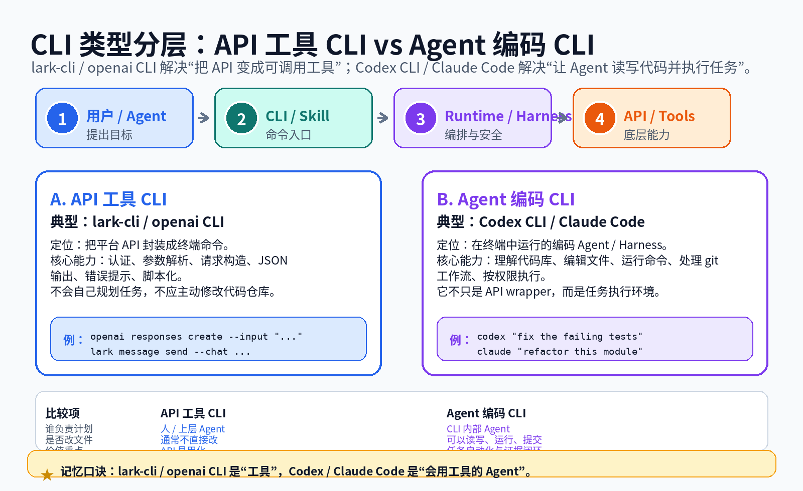
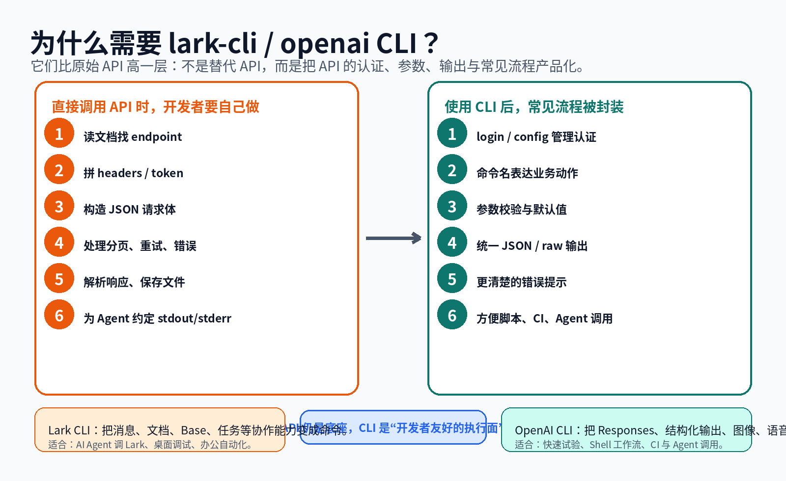
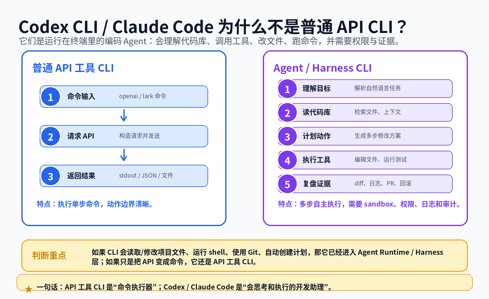
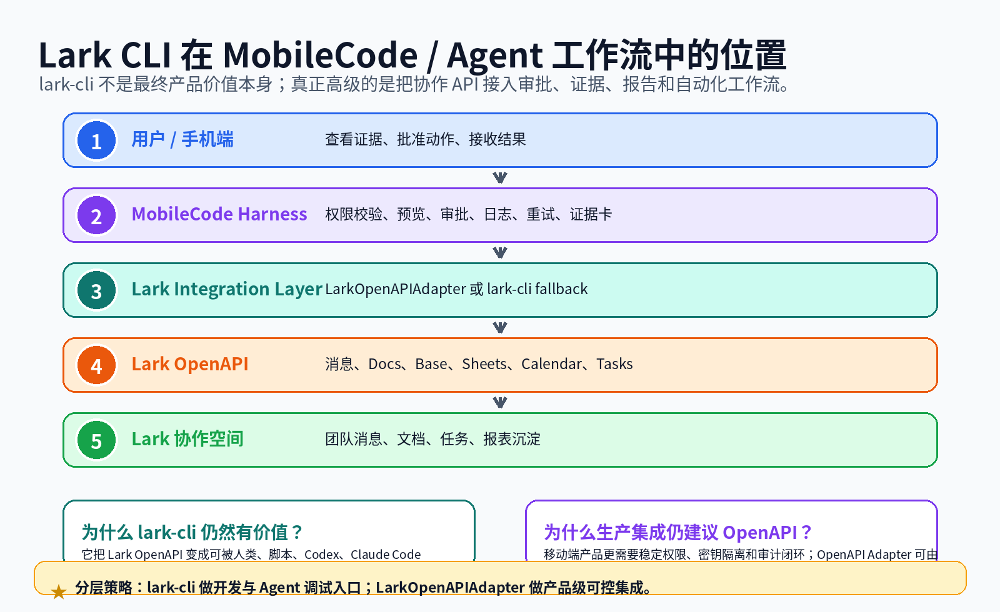

# API 工具 CLI 与 Agent 编码 CLI 图文教程

本页解释 `lark-cli`、`openai` CLI 与 `codex`、`claude` / Claude Code 这两类 CLI 的差异。

## 一句话结论

```text
lark-cli / openai CLI = API 工具 CLI：把 API 变成稳定命令。
Codex CLI / Claude Code = Agent 编码 CLI：在终端里规划、读写代码、运行命令。
```



## 为什么存在 lark-cli / openai CLI？

原始 API 很灵活，但每次都要处理认证、headers、JSON 请求体、分页、错误、流式输出和结果解析。CLI 把这些重复动作封装成命令，使人类、脚本、CI 和 Agent 可以更稳定地调用平台能力。



## 为什么 Codex CLI / Claude Code 是另一类？

它们不仅发送 API 请求，还会理解代码库、编辑文件、运行命令、处理 git 工作流，并需要权限、沙箱、日志和证据回放。



## lark-cli 在 MobileCode 里的位置

`lark-cli` 适合做开发调试和 Agent 工具入口；生产级 MobileCode 更适合直接走 Lark OpenAPI Adapter，以获得更好的密钥隔离、权限治理、移动端审批和审计证据。



## 对比表

| 工具 | 层级 | 主要价值 | 不是什么 |
|---|---|---|---|
| lark-cli | API 工具 CLI / 协作工具面 | Lark OpenAPI 的命令封装 | 不是完整 Agent Runtime |
| openai CLI | API 工具 CLI / 模型 API 工具面 | OpenAI API 的 shell-native 调用方式 | 不是编码 Agent |
| Codex CLI | Agent 编码 CLI / Harness | 读写代码、运行命令、执行开发任务 | 不是单纯 API wrapper |
| Claude Code | Agent 编码 CLI / Harness | 理解代码库、改文件、跑命令、使用 Git/MCP | 不是普通 chat CLI |

## 记忆口诀

```text
API 是机器接口。
API 工具 CLI 是命令封装。
Agent CLI 是会用工具的执行环境。
Harness 负责权限、日志、证据与安全。
```
