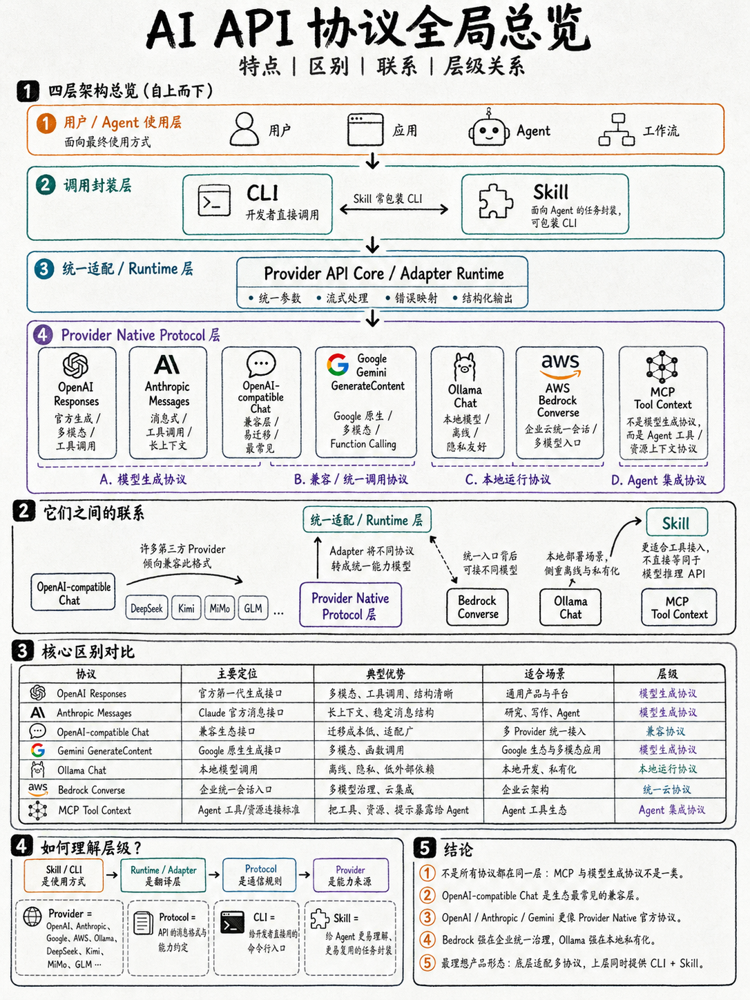
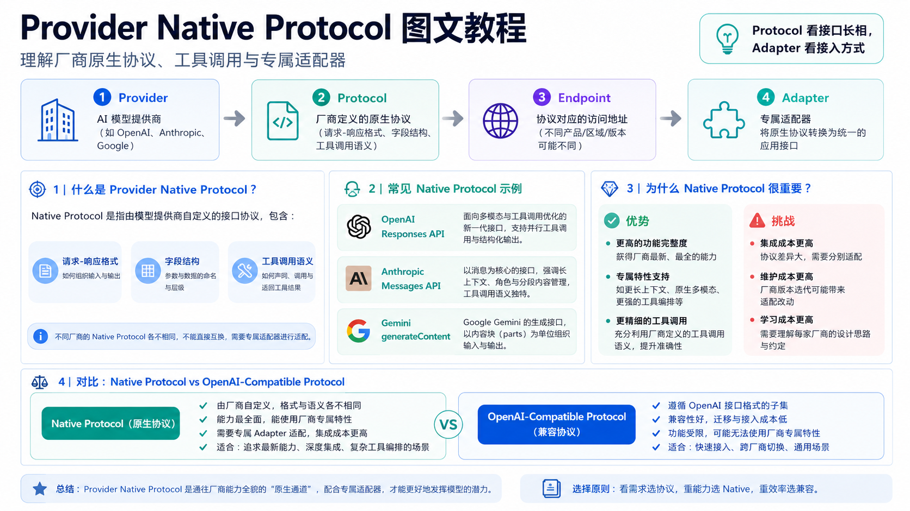
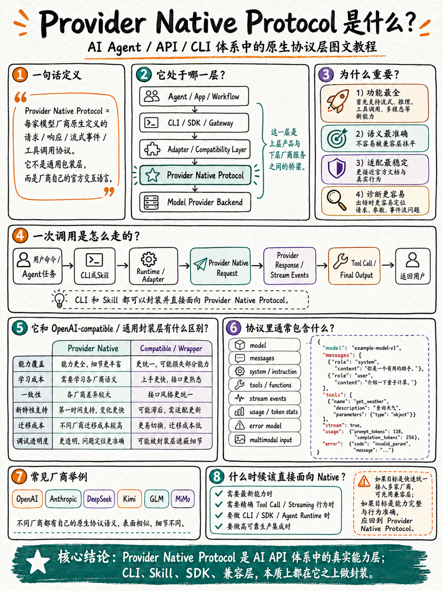
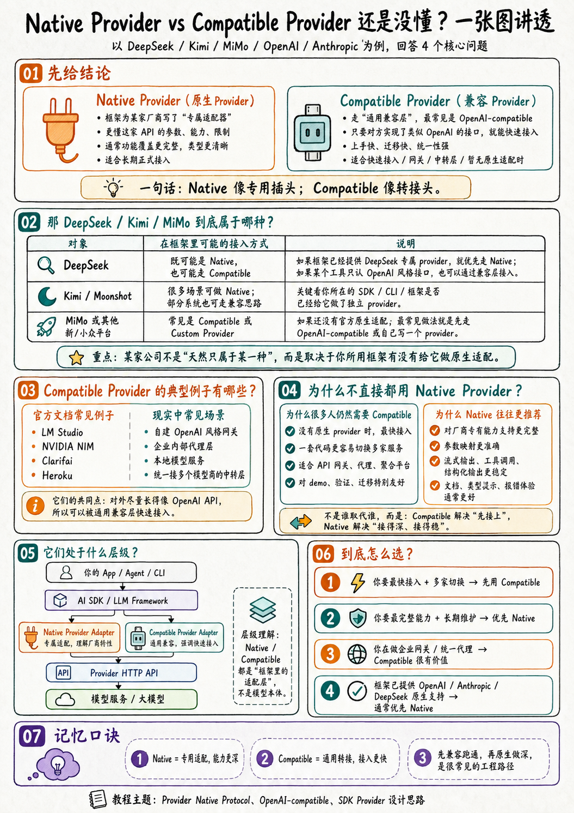
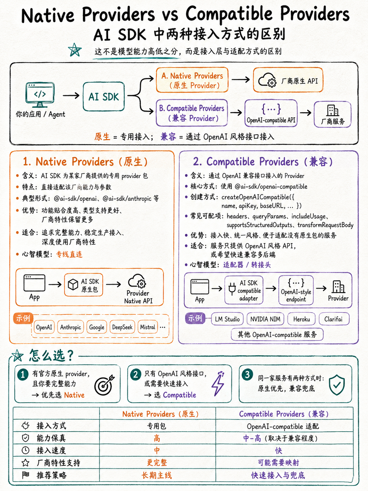
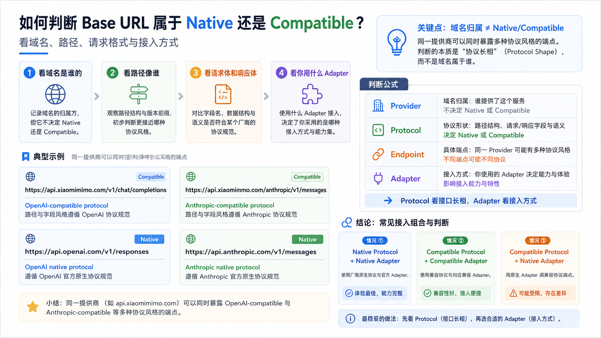
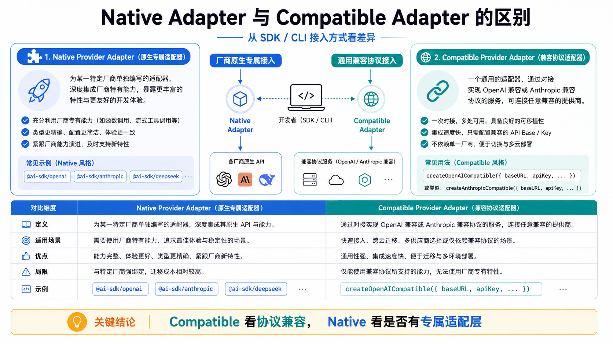
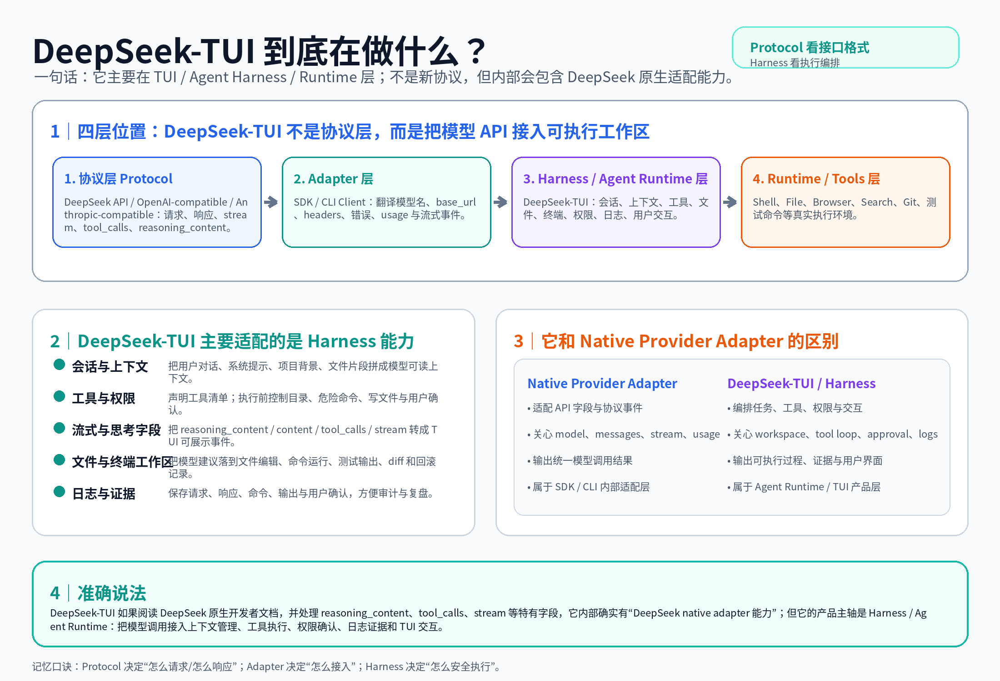

# Provider API CLI Suite v18：图文教程增强版

Provider API CLI Suite 支持多 Provider、多协议与 Agent Skills。本版重点补充了 **Native Protocol、Compatible Provider、Adapter 判断、Base URL 判断，以及 DeepSeek‑TUI 与 Harness 层的关系**。

## 一、先看全局层级



核心分层：

| 层级 | 负责什么 | 典型例子 |
| --- | --- | --- |
| User / Agent | 发起任务 | 用户、App、Agent、Workflow |
| CLI / Skill | 调用封装与任务说明 | `provider-api`、`deepseek`、`skills/provider-api` |
| Runtime / Adapter | 统一参数、流式处理、错误映射 | `provider-api-core` |
| Provider Protocol | 请求/响应/工具调用格式 | OpenAI Responses、Anthropic Messages、OpenAI-compatible Chat |
| Harness / Runtime | 任务编排、工具执行、权限、日志 | DeepSeek‑TUI、MobileCode Harness |

## 二、Provider Native Protocol 是什么





Provider Native Protocol 是模型厂商自己定义的请求、响应、流式事件、工具调用和错误语义。它不是通用包装层，而是厂商能力最完整的接口面。

## 三、Native Provider 与 Compatible Provider





一句话：**Native 像专用插头；Compatible 像转接头。**

- Native Provider Adapter：框架或 CLI 为某个厂商写专属适配器。
- Compatible Provider Adapter：使用通用兼容适配器，通过 `baseURL + apiKey` 接入 OpenAI-compatible 或 Anthropic-compatible 服务。

## 四、如何判断 Base URL



判断口诀：

```text
域名判断 Provider。
路径判断 Protocol。
SDK / CLI import 判断 Adapter。
```

例如：

| Base URL / Endpoint | 判断 |
| --- | --- |
| `https://api.xiaomimimo.com/v1/chat/completions` | MiMo Provider + OpenAI-compatible Protocol |
| `https://api.xiaomimimo.com/anthropic/v1/messages` | MiMo Provider + Anthropic-compatible Protocol |
| `https://api.openai.com/v1/responses` | OpenAI Provider + OpenAI native Responses Protocol |
| `https://api.anthropic.com/v1/messages` | Anthropic Provider + Anthropic native Messages Protocol |

## 五、Native Adapter 与 Compatible Adapter



最准确的表达方式不要只写 `native` 或 `compatible`，而要拆成：

```json
{
  "provider": "mimo",
  "protocol_type": "openai-compatible",
  "adapter_type": "native-provider-adapter 或 compatible-provider-adapter",
  "base_url": "https://api.xiaomimimo.com/v1"
}
```

同一个 base_url，因为上层接入方式不同，可能对应不同的 Adapter 判断。

## 六、DeepSeek‑TUI 到底在做什么



DeepSeek‑TUI 更准确地说是在做 **TUI / Agent Harness / Runtime 层** 的适配。它会理解 DeepSeek API 的模型、参数、流式、tool_calls、reasoning_content 等特有字段，所以内部可能包含 DeepSeek native adapter 能力；但它的产品主轴不是重新定义协议，而是把模型调用接入上下文管理、工具执行、文件/终端工作区、权限确认、日志与证据。

## 七、最终记忆口诀

```text
Protocol 看接口格式。
Adapter 看接入方式。
Harness 看是否在编排任务、调用工具、修改文件、留下证据。
```
