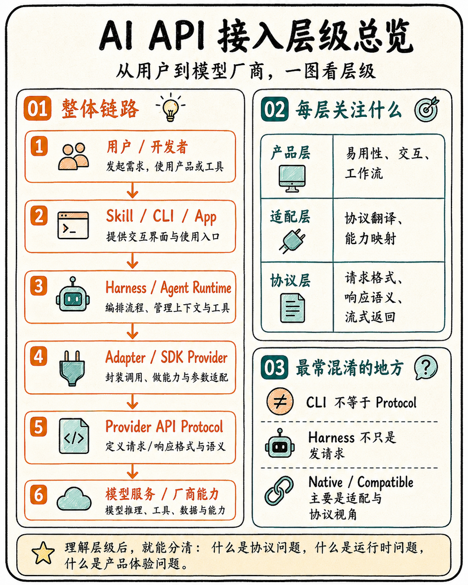
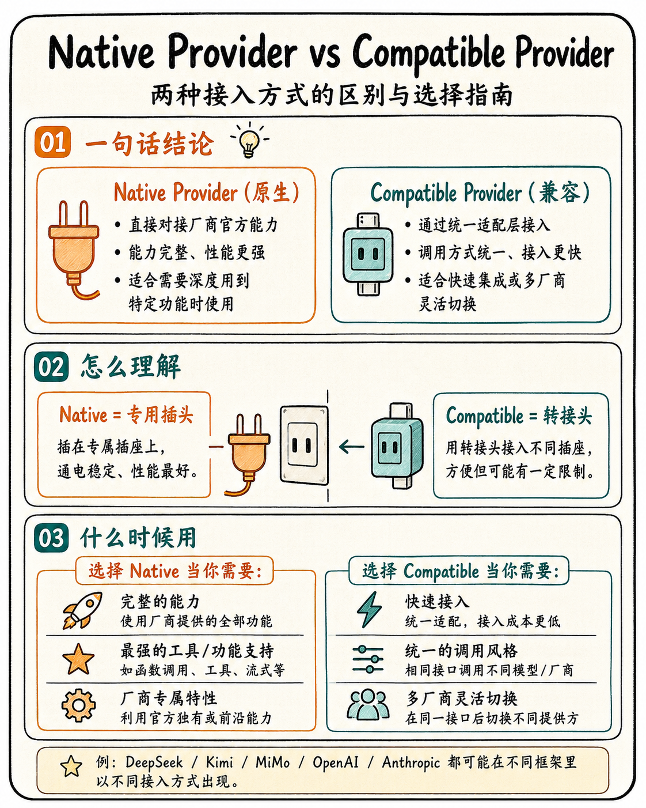
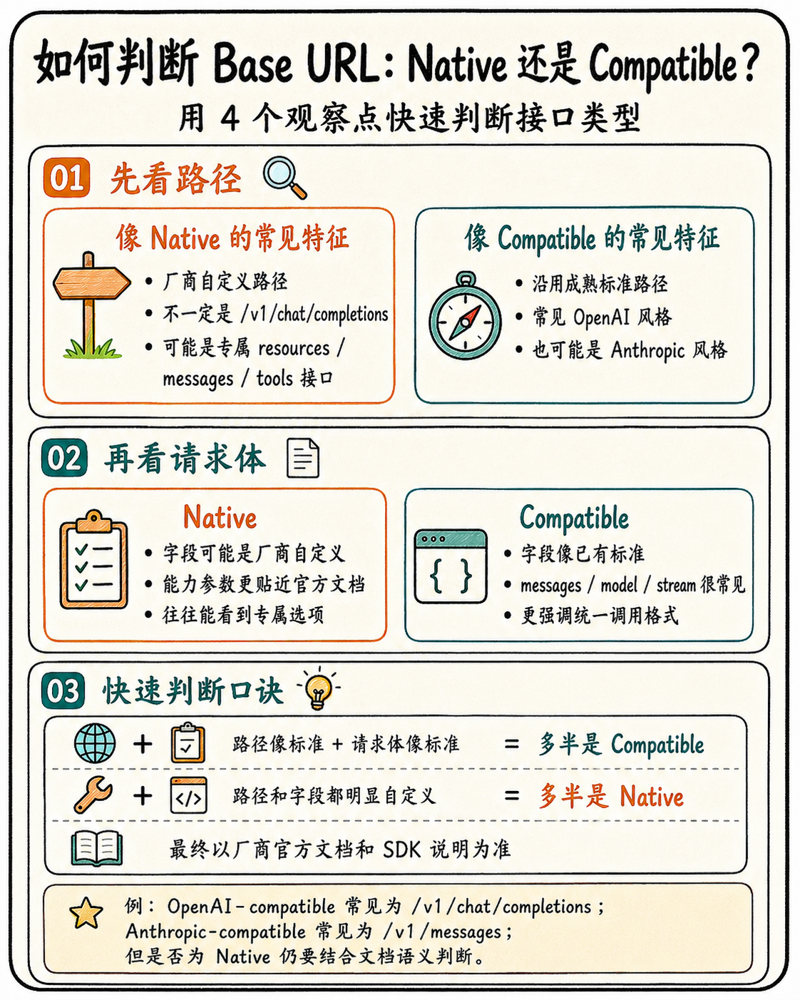
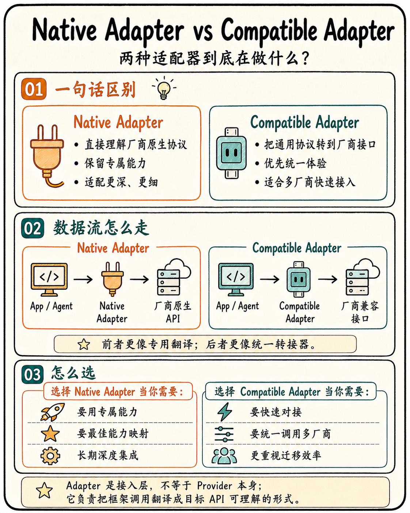
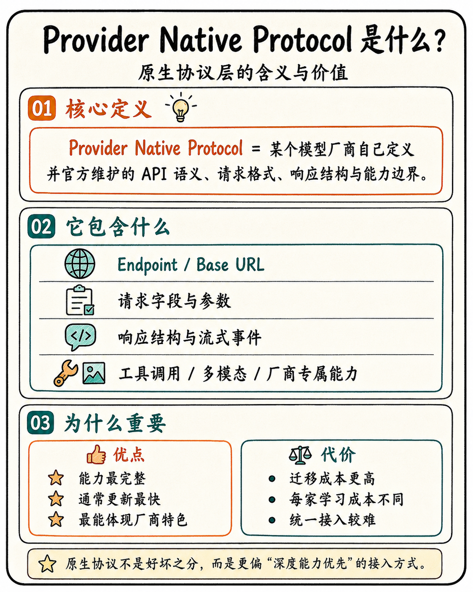
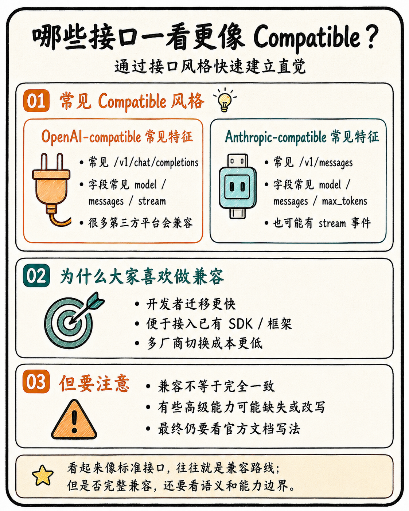
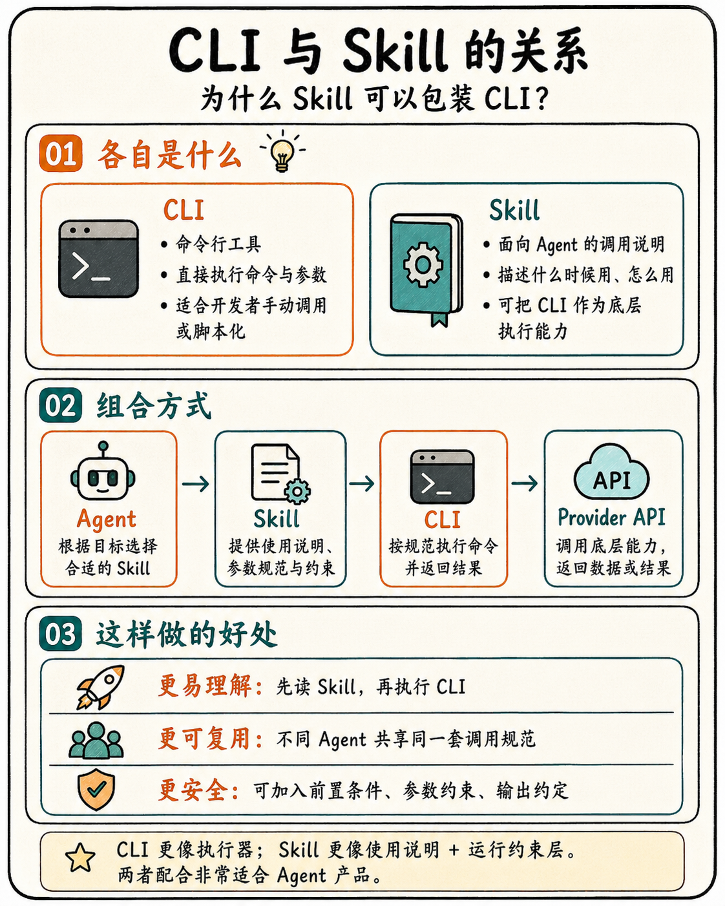
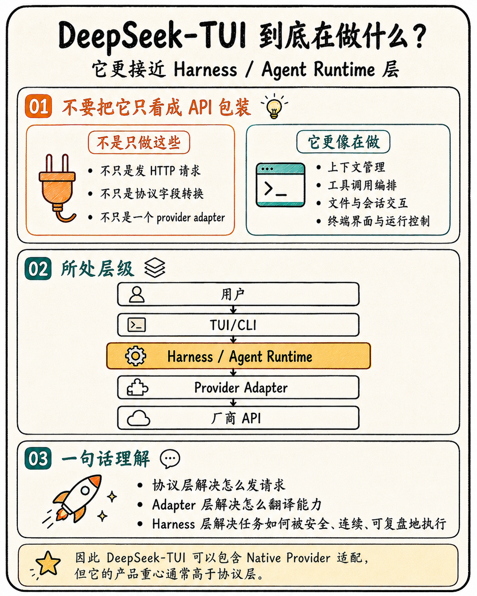

# Provider API CLI Suite v18 最终图文增强收尾版

这版把 v18 的多协议、CLI、Skill、Native / Compatible、Harness 层级教程做成更适合阅读的小图文结构。大图适合总览，小图适合插入到不同教程位置，便于用户逐步理解。

## 1. 最终判断框架

- **Provider**：看域名和服务归属，判断是谁提供能力。
- **Protocol**：看路径、请求体和响应语义，判断接口长得像 OpenAI、Anthropic、Gemini、Ollama 还是厂商原生。
- **Adapter**：看 SDK / CLI / Framework 怎么接，判断是专属 Native Adapter 还是通用 Compatible Adapter。
- **Harness**：看是否管理上下文、工具、文件、权限、日志、重试和证据。



## 2. Native Provider vs Compatible Provider

Native Provider 像专用插头：能力完整、贴近厂商特性、适合长期深度集成。Compatible Provider 像转接头：接入快、迁移快、适合多厂商统一调用。



## 3. Base URL 怎么判断

Base URL 不能只看域名。域名只告诉你 Provider 是谁；路径和请求体更能告诉你协议风格；Adapter 才决定上层接入方式。



常见判断：

```text
/v1/chat/completions      -> 多半是 OpenAI-compatible
/anthropic/v1/messages    -> 多半是 Anthropic-compatible
/v1/responses             -> OpenAI Responses 风格
:generateContent          -> Gemini 原生协议
/api/chat                 -> Ollama 原生协议
```

## 4. Native Adapter vs Compatible Adapter

Adapter 是接入层，不等于 Provider 本体。Native Adapter 是专属翻译器，Compatible Adapter 是通用转接器。



## 5. Provider Native Protocol

Provider Native Protocol 是模型厂商自己定义并维护的 API 语义、字段结构、响应格式与能力边界。它通常最能体现厂商能力，但迁移成本也更高。



## 6. 哪些接口一看更像 Compatible

OpenAI-compatible 常见路径是 `/v1/chat/completions`，Anthropic-compatible 常见路径是 `/v1/messages` 或 `/anthropic/v1/messages`。看起来像标准接口，不代表能力完全一致，最终仍要看官方文档和实际字段。



## 7. CLI 与 Skill 的关系

CLI 是稳定执行器，适合开发者、脚本和 CI 调用；Skill 是给 Agent 的说明书，描述什么时候用、怎么用、有什么约束、如何解析结果。



## 8. DeepSeek-TUI 的层级定位

DeepSeek-TUI 可以包含 DeepSeek 的专属适配逻辑，但它更接近 Harness / Agent Runtime：会处理上下文、工具调用、文件交互、终端界面、运行控制和证据链，而不只是 API wrapper。



## 9. 最终口诀

```text
域名判断 Provider。
路径判断 Protocol。
SDK / CLI 判断 Adapter。
任务编排、工具执行、日志证据判断 Harness。
```

选型建议：

- 快速接入、多厂商切换：优先 compatible。
- 长期生产、完整能力、稳定 tool/stream/schema 行为：优先 native。
- 文件修改、命令执行、审批、证据链：进入 Harness / Agent Runtime。
